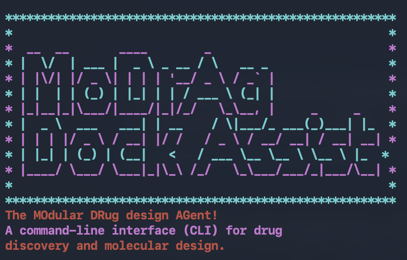

<p align="center">
  
</p>

# Modrag-dock

**The MOdular DRug design AGent** — a command-line interface (CLI) for drug
discovery and molecular design. Modrag-dock is a tool-using LLM agent (powered by
an Ollama-hosted model) that takes a plain-English request like *"dock dopamine into
SULT1A3"* and autonomously runs the full workflow: find the protein in the PDB,
fetch its structure, detect the binding site **blindly** (no prior knowledge of
where it is), and dock the requested ligands with AutoDock Vina.

---

## Features

- **Conversational agent loop.** Ask for docking in natural language; the agent
  decides which tools to call and in what order.
- **PDB lookup & retrieval.** Searches the RCSB Protein Data Bank by protein name,
  picks a relevant PDB ID, and downloads the `.pdb` file.
- **Blind binding-site detection.** A pure-Python buriedness grid scan finds
  putative pockets on a receptor of *unknown* binding site — no external pocket
  tool required.
- **AutoDock Vina docking.** Each ligand is docked into the top-ranked pocket(s);
  the best-scoring pose is written out as an `.sdf` for inspection in PyMOL.
- **Caching.** Receptors already present in `pdb_files/` (matched by PDB ID) are
  reused instead of being re-downloaded.
- **Proximity-fallback-to-second-pocket (opt-in).** When enabled, blind docking
  checks the top-2 pockets and, if the best-score pocket's pose does *not* sit
  near a co-crystallized ligand, switches to the second-best pocket when it
  *does* — preferring **proximity to a known ligand over Vina score**. See
  [Proximity fallback](#proximity-fallback-to-second-pocket-opt-in).

---

## Project layout

```
dock_assist/
├── code/
│   ├── dock_assist.py              # agent CLI: prompt loop, tool dispatch, Ollama client
│   ├── modrag_protein_functions.py # PDB search, PDB retrieval, SMILES lookup
│   └── vina_dock.py                # blind pocket detection + AutoDock Vina docking
├── pdb_files/                      # fetched receptors (.pdb) + docked poses (.sdf)
├── requirements.txt
└── README.md
```

The agent exposes four tools to the LLM:

| Tool | Purpose |
|------|---------|
| `find_PDBID_node` | Search the PDB by protein name; return candidate PDB IDs + titles. |
| `get_protein_from_pdb` | Download the `.pdb` file for a chosen PDB ID (reuses cached files). |
| `smiles_node` | Resolve molecule names to SMILES via PubChem. |
| `blind_dock_agent` | Detect binding pockets and dock the ligands (see below). |
| `check_nearby_molecules` | Checks for docked ligand proximity to crystal small molecules. |

---

## Installation

```bash
python3 -m venv dock-env
source dock-env/bin/activate
pip install -r requirements.txt
```

You also need:

- **Open Babel** (`obabel` on PATH) for PDB↔PDBQT conversion. This ships with
  the `openbabel-wheel` package — the `obabel` CLI is installed into your
  virtualenv's `bin/` automatically by `pip install -r requirements.txt`, so no
  separate Homebrew/system install is needed.
- **An Ollama API key** in the `OLLAMA_API_KEY` environment variable. The client
  connects to `https://ollama.com`. Any Ollama account works — free accounts run
  the default model with no extra setup; Pro accounts can select a stronger model
  with `--model` (see [Choosing a model](#choosing-a-model)).
- **A Vina binary.** By default `vina_dock.py` reuses the copy of AutoDock Vina
  vendored inside the `dockstring` package (no separate install needed). A
  `--vina-bin` flag is available if you want to point at a different build.

---

## Usage

Modrag-dock is designed to **just work out of the box**. Set your API key once,
then run it — no other configuration required:

```bash
export OLLAMA_API_KEY=...
cd code
python3 dock_assist.py
```

You'll see the banner and a prompt:

```
I'm the MoDrAg docking assistant! I can help with protein docking.
I just need a protein name and names or smiles for the ligands.
What can I help with today? >
```

Type a request such as `dock dopamine into SULT1A3` and the agent will search the
PDB, fetch `2A3R`, build the receptor, detect its pockets, and dock the ligand.
At the end of each response the CLI prints a note telling you where the `.pdb`
receptor and the docked `.sdf` pose files live, and that you can view them in
PyMOL.

Type `quit` to leave. On exit the CLI reminds you to move any `.sdf` files you
want to keep, because **leftover `.sdf` files are deleted from `pdb_files/` at
the start of the next run** (the `.pdb` receptors are kept).

### Choosing a model

The agent is powered by an Ollama-hosted model. The defaults are chosen so you
can run without thinking about models:

- **Free Ollama account → use the default.** Just run `python3 dock_assist.py`
  with no flags. The default model (`gemma4:31b`) works out of the box and needs
  no setup.
- **Pro Ollama account → choose `glm-5.2`.** It reasons better through the
  tool-calling loop. Select it from the command line:

  ```bash
  python3 dock_assist.py --model glm-5.2
  ```

The `--model` flag accepts any model name available on your Ollama host — you can
pass any model without editing the file:

```bash
python3 dock_assist.py --model kimi-k2.7-code
```

Run `python3 dock_assist.py --help` to see all options.

### Print / debug mode

```bash
python3 dock_assist.py --print
```

Surfaces the model's chain-of-thought, tool-call arguments, and raw tool
results on stdout for debugging.

### Standalone docking (bypassing the agent)

`vina_dock.py` is also runnable directly for a known receptor + SMILES, either
with an explicit box or in blind mode:

```bash
# explicit box (binding site known)
python3 vina_dock.py --receptor pdb_files/SULT1A3_2A3R.pdb \
    --smiles 'c1cc2ccccc2cc1O' --center -1.0 2.0 3.0 --size 20 20 20

# blind mode (binding site unknown)
python3 vina_dock.py --receptor pdb_files/SULT1A3_2A3R.pdb \
    --smiles 'c1cc2ccccc2cc1O' --blind --blind-npockets 3
```

---

## How the blind docking finds the binding site

This section explains, in depth, the algorithm in `find_pockets()` inside
`code/vina_dock.py`. Classical AutoDock Vina requires the user to supply a search
box — the cubic region of space the ligand is allowed to explore. That means the
user must already know where the binding site is. **Blind docking** removes that
requirement: the agent is given only the receptor structure and must figure out
plausible binding pockets on its own before it can run Vina.

Modrag-dock does this with a **buriedness grid scan** — a geometry-only method
that needs no external pocket-detection tool (no fpocket, no SiteMap, no
training set). It exploits one physical intuition:

> A binding pocket is a region of empty space that is **surrounded by protein**.
> A flat solvent-exposed surface, by contrast, is empty space that is merely
  *next to* protein, not enclosed by it.

The algorithm turns that intuition into a number, ranks voxels by it, clusters
them, and ranks the clusters.

### Step 1 — Read the receptor's heavy atoms

`parse_pdb_heavy_atoms()` reads the `ATOM` records of the receptor PDB file and
collects the 3D coordinates of every heavy atom (hydrogens excluded). Crucially,
**`HETATM` records are skipped** — waters, ions, and cofactors would otherwise
sit inside cavities and fill them in, making a real pocket look "solid" instead
of "empty-but-surrounded." A `cKDTree` (scipy) is built over these coordinates for
fast nearest-neighbour and radius queries.

If the receptor has fewer than 100 heavy atoms, the run aborts: pocket detection
is unreliable on such a small structure.

### Step 2 — Build a 3D grid covering the receptor

A cubic grid is laid over the receptor with `spacing = 1.0 Å`, spanning from
`min(coords) − 2 Å` to `max(coords) + 2 Å` in each axis. Each grid point is a
candidate "empty-space voxel." For every voxel two quantities are computed
against the receptor's atom tree:

- **`d_near`** — the distance to the *nearest* receptor heavy atom.
- **`buried`** — the number of receptor heavy atoms within a shell of radius
  `r_shell = 8.0 Å` of the voxel. This is the *buriedness* score: it counts how
  much protein surrounds that point in space.

### Step 3 — Keep only "empty-but-near-protein" voxels

A voxel is interesting only if it is **not** inside the protein but **is** close
to it. The *distance band* `[d_min, d_max] = [2.5, 8.0] Å` enforces this:

- `d_near < 2.5 Å` → the voxel is *inside* the protein surface (clashing); drop it.
- `d_near > 8.0 Å` → the voxel is far out in solvent; drop it.
- `2.5 Å ≤ d_near ≤ 8.0 Å` → the voxel is in the shell just outside the protein
  surface. **This is where pockets live.** Keep it, along with its buriedness.

If fewer than 50 such voxels survive, the receptor has no near-protein empty
space to speak of and the run aborts.

### Step 4 — Threshold to the most-buried voxels

Of the surviving band voxels, only the **top `top_frac = 6%`** by buriedness are
kept. The rest are discarded. This thins the cloud down to the genuinely
deep points and is the first of two sieves that separate real pockets from
surface noise.

### Step 5 — Cluster with DBSCAN

The kept voxels are clustered spatially with **DBSCAN** (`eps = 2.5 Å`,
`min_samples = 25`). Each resulting cluster is one *candidate pocket*. Noise
points (label −1) are discarded.

The two parameters of this stage are the ones that took the most tuning, and the
docstring of `find_pockets()` records *why* each default is what it is:

- **`min_samples = 25`** is what stops **diffuse surface voxels** from merging
  into one giant blob. A permissive `top_frac` keeps enough moderate-buriedness
  voxels to define a true cleft, but it also lets low-density near-surface voxels
  survive. DBSCAN with a low `min_samples` then merges all of those into a single
  10,000+ voxel blob whose centroid is far from any real binding site and which
  drowns the true pocket in the ranking. Raising `min_samples` to ~25 fragments
  that diffuse blob — scattered low-density regions simply cannot sustain 25
  neighbours within a 2.5 Å ball — while dense, focused true pockets remain
  intact.

- **`eps = 2.5 Å`** is the neighbourhood radius; together with `min_samples = 25`
  it demands that a core voxel have a dense local cloud around it, which is
  exactly the geometry of a cavity and not the geometry of a surface patch.

### Step 6 — Rank clusters by depth × log(volume)

Each cluster becomes a candidate pocket described by:

- `center` — the mean coordinate of its voxels (this becomes the Vina box center).
- `n_voxels` — the number of voxels in the cluster (a proxy for pocket volume).
- `buriedness` — the mean buriedness of its voxels (how enclosed the pocket is).
- `score = buriedness × log1p(n_voxels)` — the ranking key.

The score is the second tuned decision, and again the docstring explains the two
failure modes it fixes:

- **Mean buriedness alone** favours tiny deep crevices: a 4-voxel pit can have a
  higher mean buriedness than a 400-voxel active-site cleft, so the true site — a
  sizeable cleft with only *moderate* buriedness — ranked #6–#32 on the DUD-E
  benchmark and was only rescued because the 28 Å Vina boxes happened to overlap
  it. Multiplying by `log1p(volume)` rewards substantial cavities while damping
  volume enough that a giant flat surface patch (high volume, low buriedness)
  can't dominate — `log ≪ √`, so volume contributes but doesn't run away.
- The composite `b·log1p(n)` therefore balances **how enclosed** a region is
  against **how capacious** it is, which is precisely the geometry of a real
  binding site: deep *and* big enough to host a ligand.

Pockets are sorted by `score` descending; the top `npockets` are passed to Vina.

### Step 7 — Dock into the top-N pockets and keep the best score

`blind_dock()` then docks each ligand into each of the top-`npockets` pockets in
turn. A cubic Vina box of `blind_box = 28 Å` per side is centered on each pocket
center. The pose with the lowest (best) affinity across all pockets is the
molecule's final answer, and its top poses are written to `<stem>_<i>.sdf`.

The default `npockets = 1` is fast and usually enough: on the validated set the
true site is the **#1** pocket. Raising it to 3 buys a safety net for a novel
receptor at 3× the cost.

### Why the defaults are trustworthy

The defaults were validated on two independent sets, both documented in the
`find_pockets()` docstring:

1. **DUD-E receptors** (HMGCR, ADRB1, ADRB2, MAOB, DRD2) against the dockstring
   box centers as ground truth. With `top_frac = 0.06`, `min_samples = 25`, and
   the `b·log1p(n)` score, the true binding site is the **#1 pocket on all five**
   receptors, with the detected center **3–9 Å** from the dockstring reference
   center. This all-#1 result holds across a robust plateau
   (`top_frac ∈ [0.04, 0.08]`, `min_samples ∈ [20, 40]`), so the defaults are not
   on a knife-edge.
2. **SULT1A3 (PDB 2A3R)** — a homodimer co-crystallised with dopamine and PAP —
   used as a held-out cross-check *not* involved in tuning the parameters. The
   two substrate pockets are detected as the **top-2 pockets**, each ~7.5 Å from
   a bound-dopamine centroid, and a blind dock of dopamine lands in the correct
   active site within ~5 Å (atom-atom) of the crystallographic dopamine.

### Tuning the detection (CLI flags)

If a novel receptor misbehaves, the blind-mode CLI flags let you nudge the
sieves without touching code:

| Flag | Default | Effect of raising it |
|------|---------|-----------------------|
| `--blind-top-frac` | 0.06 | Keeps more moderate-buriedness cleft voxels (good) but also diffuse surface voxels that can merge into a giant blob (bad unless `--blind-min-samples` is also raised). |
| `--blind-min-samples` | 25 | Fragments the diffuse low-density surface blob that drowns true pockets; dense true clefts survive. |
| `--blind-band` | 2.5 8.0 | Widens the "empty-but-near-protein" shell. |
| `--blind-r` | 8.0 | Larger buriedness shell → noisier, slower buriedness counts. |
| `--blind-spacing` | 1.0 | Finer grid (slower, more memory); coarser grid (faster, coarser pockets). |
| `--blind-box` | 28 | The cubic Vina box placed on each pocket center. |
| `--blind-npockets` | 3 (CLI) / 1 (agent) | Dock more pockets as a safety net. |

The validated plateau (`top_frac ∈ [0.04, 0.08]`, `min_samples ∈ [20, 40]`) is
the safe region to experiment in.

---

## Proximity fallback to second pocket (opt-in)

Blind docking ranks pockets by a geometry score and, by default, keeps only the
**#1** pocket and trusts its best Vina pose. That is usually right — but not
always. A real failure case motivated this feature: **rosuvastatin docked into
HMGCR (PDB 1HW9)** scored a respectable **−8.0 kcal/mol**, yet the pose landed in
a pocket that did **not** overlap the reference co-crystallized ligand
(simvastatin) — no crystal molecule within 5.0 Å. A good score in the wrong place
is a silent failure the agent would otherwise report as success.

The proximity fallback folds the same co-crystallized-ligand proximity check that
powers the separate `check_nearby_molecules` tool *into* the docking step itself,
so `blind_dock` can auto-correct:

1. When enabled, `blind_dock` docks the **top-2** detected pockets.
2. It parses the receptor's `HETNAM`/`HETATM` records for co-crystallized ligand
   coordinates (waters/ions excluded).
3. It measures each pose's **minimum atom-to-atom distance** to every
   co-crystallized ligand (the same 5.0 Å metric as `check_nearby_molecules`).
4. If the **best-score** pocket's pose is **off-target** (> 5.0 Å from every
   crystal ligand, or unreadable) and the **2nd-best** pocket's pose **is** near
   one (≤ 5.0 Å), it **switches to the 2nd pocket** — even though its Vina score
   is worse. **Proximity to a known ligand is preferred over Vina score.**
5. If *neither* pose is near a ligand, or the crystal has no bound ligand, it
   falls back to the best score (unchanged behavior).

### Enabling it

It is **off by default** so the agent behaves exactly as before. To turn it on,
flip one line in `code/dock_assist.py`:

```python
use_second_pocket_fallback = False   # → True
```

This propagates to `vina_dock.FALLBACK_TO_SECOND_POCKET` (the same pattern used
for the `--print` flag). You can also set the global directly:

```python
import vina_dock
vina_dock.FALLBACK_TO_SECOND_POCKET = True
```

The cutoff is `NEAR_LIGAND_CUTOFF = 5.0` Å in `vina_dock.py`, mirroring
`NEARBY_DISTANCE_CUTOFF` in `modrag_protein_functions.py` so "near a known
ligand" means the same thing in the auto-switch and the post-hoc check tool.

> **Why a global flag and not a function argument?** `blind_dock_agent`'s
> signature is unchanged on purpose. The LLM tool-caller would otherwise
> hallucinate the optional parameter and pass bogus values. The flag is a
> developer toggle the model never sees in the tool schema — a developer flips
> it in code; the agent calls the same two-argument tool either way.

### What you'll see in the output

When the fallback fires, the docking report gets a header line:

```
proximity fallback: enabled (2 crystal ligand occurrence(s), cutoff 5.0 A)
```

and the chosen pose's detail notes the switch, e.g.:

```
... modes; switched from pocket #1 (off-target, 12.3 A from crystal ligand) to pocket #2 (near, 3.1 A)
```

If the crystal has no co-crystallized ligand to compare against:

```
proximity fallback: enabled but no co-crystallized ligand found; falling back to best score
```

---

## Files written by a run

- `pdb_files/<protein_name>_<pdb_id>.pdb` — the fetched receptor (kept across runs;
  reused if a file with the same PDB ID already exists, even under a different
  protein name).
- `pdb_files/<stem>_<i>.sdf` — the docked poses (top 3) for ligand *i*, from its
  best-scoring pocket. **These are deleted at the start of the next run**, so
  move any you want to keep.
- `<stem>.pdbqt` — the rigid receptor PDBQT built once and reused across calls.
- Per-run intermediates (ligand PDBQT, per-pocket poses/logs) go to a temp
  directory that is cleaned up at the end.

Open the `.pdb` and `.sdf` files together in **PyMOL** to inspect the docked
pose in the receptor's binding site.

---

## Requirements

`ollama`, `rdkit`, `scipy`, `scikit-learn`, `pubchempy`, `pandas`, `requests`,
`rcsb-api`, `dockstring`, `openbabel-wheel`, `rich` — see `requirements.txt`.
The `obabel` CLI comes from `openbabel-wheel` and is placed on your PATH
automatically; no extra install step.